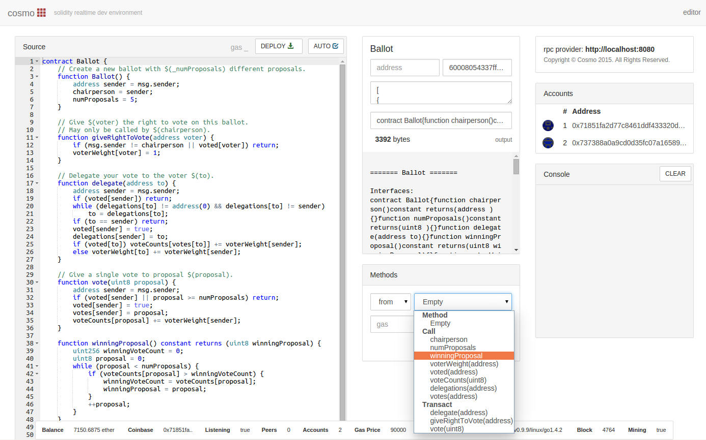

# meteor-dapp-cosmo
A MeteorJS realtime solidity development environment DApp.

** Please note that this DApp is still in Alpha (still working out the bugs). Compiler upgrade coming soon!

##  Installation

Clone this repo

    $ git clone http://github.com/SilentCicero/meteor-dapp-cosmo.git

Start a local geth node:

    $ geth --rpc --rpcaddr="localhost" --mine --unlock=primary --rpcport="8080" --rpccorsdomain="http://localhost:3000" --loglevel=5 --maxpeers=0

Start Cosmo using Meteor

    $ cd meteor-dapp-cosmo/app
    $ meteor

Goto http://localhost:3000, enjoy!

##  DApp Functionality
- Deploy and test solidity contracts
- Vet contracts using function calls/transactions
- Switch between auto and manual compiling mode
- See your node information in realtime
- Immediate JSON contract descriptions

##  Page Layout
- Source code editor (left column)
- Realtime contract & contract function information (middle column)
- Accounts and console for method testing (right column)

##  About

This DApp will help developers code in solidity, so they can build solid contracts in realtime that are thoroughly vetted.

Cosmo uses Chriseth's <a href="http://chriseth.github.io/cpp-ethereum/">Realtime Browser Compiler</a>.

##  TODO
- Better i18n
- Allow DApp to boot even without no GETH connection
- Deploy on meteor.com
